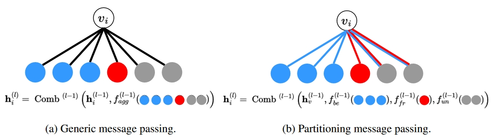

## Introduction
This is the code for the ICLR 2024 paper of **PMP**: [Partitioning Message Passing for Graph Fraud Detection](https://openreview.net/pdf?id=tEgrUrUuwA).

Label imbalance and homophily-heterophily mixture are the fundamental problems encountered when applying Graph Neural Networks (GNNs) to Graph Fraud Detection (GFD) tasks. In this work, we introduce Partitioning Message Passing (PMP), an intuitive yet effective message passing paradigm expressly crafted for GFD. In the neighbor aggregation stage of PMP, neighbors with different classes are aggregated with distinct node-specific aggregation functions. By this means, the center node can adaptively adjust the information aggregated from its heterophilic and homophilic neighbors, thus avoiding the model gradient being dominated by benign nodes which occupy the majority of the population. A brief overview of our framework is illustrated in the following picture.
<p align="center"></p>


## Directory Structure
The repository is organized into several directories, each serving a specific purpose:

* ```config/```: The hyper-parameter configurations of our model.

* ```checkpoints/```: The trained weights of the model.

* ```DataHelper/```: Code for dataset processing.

* ```model/```: Code for the PMP model.

* ```training_procedure/```: Code for training, validation and testing.

* ```utils/```: Code for some used tools.

## Installation

- Install required packages: ```pip install -r requirements.txt```
- Dataset resources:
    - To run experiments for dataset used in the paper, please download from the following links and put them under `datasets/` (see below for instructions on organizing the datasets).
    -  ``Yelp``and ``amazon``dataset: directly run the project and these datasets will be download automatically.
    - ``T-Finance`` and ``T-Social``: Download from [google drive](https://drive.google.com/drive/folders/1PpNwvZx_YRSCDiHaBUmRIS3x1rZR7fMr?usp=sharing) provided by https://github.com/squareRoot3/Rethinking-Anomaly-Detection.


## Usage:
- Hyper-parameter settings are put into the `config/` folder.

- To run the model, use `--dataset` to specify datasets, `--multirun` the number of running times, `--train_ratio` the ratio of training set, and `--gpu_id`. 

- Executing the following command to run the code: ```python main.py --dataset yelp/amazon/tfinance --train_ratio 0.4 --gpu_id 0```


## Pretrained Model
Run our pretrained model to reproduce the results provided in the paper
```
python test.py --dataset yelp/amazon/tfinance
```

## Running Example

<p align="center"></p>

## Citation
If you find our work useful, please cite:
```
@inproceedings{
zhuo2024partitioning,
title={Partitioning Message Passing for Graph Fraud Detection},
author={Wei Zhuo and Zemin Liu and Bryan Hooi and Bingsheng He and Guang Tan and Rizal Fathony and Jia Chen},
booktitle={The Twelfth International Conference on Learning Representations},
year={2024},
url={https://openreview.net/forum?id=tEgrUrUuwA}
}
```

Feel free to contact jhuow@proton.me if you have any questions.