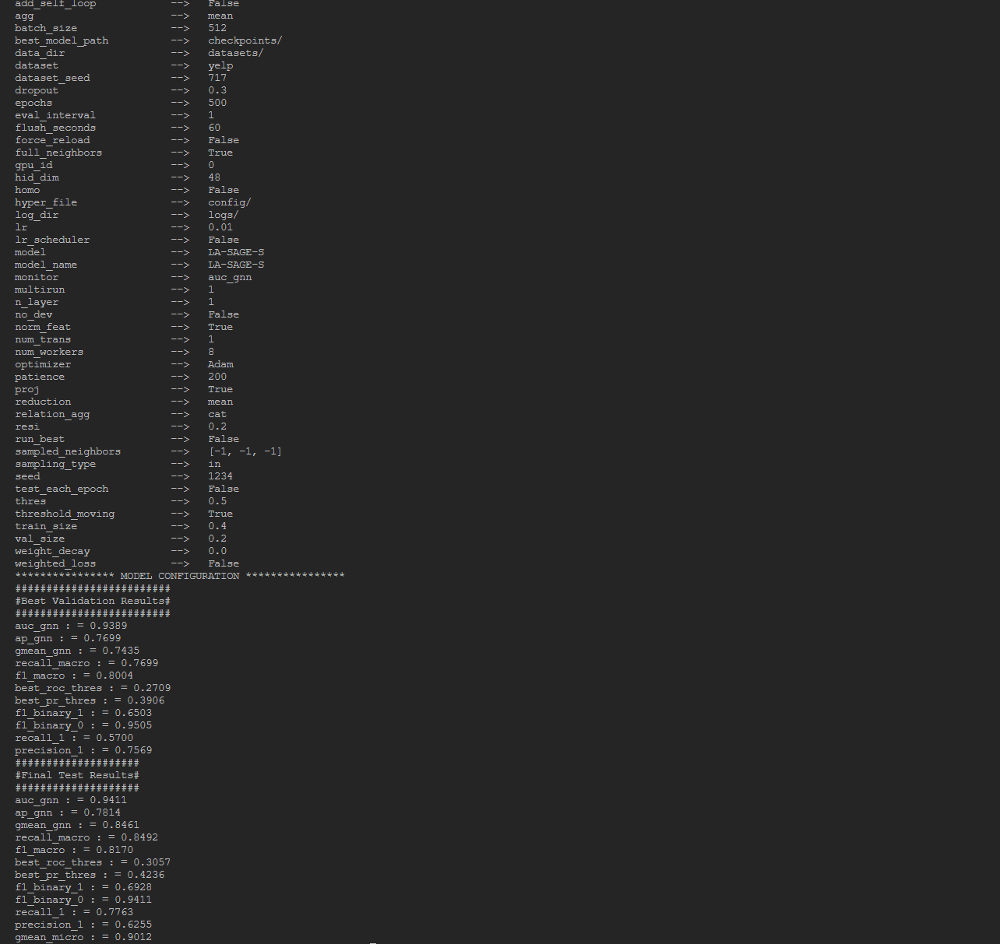

# PMP: Partitioning Message Passing for Graph Fraud Detection

# Installation

```
pip install -r requirements.txt
```

# Datasets

To run experiments for dataset used in the paper, please download from the following links and put them under `datasets/` (see below for instructions on organizing the datasets).

 ``Yelp``and ``amazon``dataset: directly run the project and these datasets will be download automatically.

``T-Finance`` and ``T-Social``: Download from [google drive](https://drive.google.com/drive/folders/1PpNwvZx_YRSCDiHaBUmRIS3x1rZR7fMr?usp=sharing) provided by https://github.com/squareRoot3/Rethinking-Anomaly-Detection.

# How to run

```
python main.py --dataset yelp/amazon/tfinance --train_ratio 0.4 --gpu_id 0
```

## Run our pretrained model to reproduce the results provided in the paper

```
python test.py --dataset yelp/amazon/tfinance
```

## Example

<p align="center"></p>
